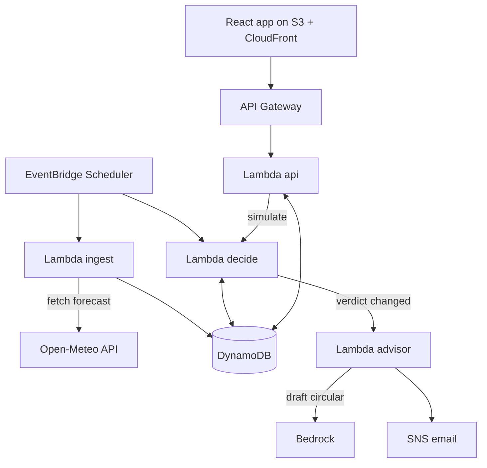

# SAANS: Master Plan (Single Source of Truth)

Project: **Saans**, a school air-quality *decision engine* (not a dashboard)
Event: Environmental Hacks, WeMakeDevs x AWS, Oct 8-11 2026, **Track 01: Air** (sub-theme: school safety on bad AQI days)
Owner: Boss. Rename the product freely, but change it everywhere at once.

> RULE FOR EVERY AI AGENT READING THIS: This file is the contract. Do not add services, features, or libraries that are not listed here. If something is ambiguous or seems wrong, STOP and ask the owner. Do not invent AWS service names, API parameters, or package versions; verify against official docs.

---

## 0. Verify first (things I could not confirm; do these before coding)

| # | Item | Why it matters | Where |
| --- | ------ | ---------------- | ------- |
| 1 | Student verification done on AWS Builder Center | Required to compete (per event page) | builder.aws.com |
| 2 | Read the Rules page + "Who can participate?" FAQ + submission deadline | The pasted page omitted FAQ answers and the exact deadline. Assume submission closes by end of Sun Oct 11 until confirmed | event page |
| 3 | Open-Meteo Air Quality API returns hourly `pm2_5`, `pm10`, `us_aqi` forecast for a lat/lon, no key | It is our only data source. Test with one curl tonight | open-meteo.com docs |
| 4 | Amazon Bedrock model access in your chosen region | AI circular writer is a P1 feature; the system must work without it | AWS console > Bedrock |
| 5 | AWS account created, free-tier credits visible, budget alarm set | Avoid surprise bills | AWS console > Billing |
| 6 | SNS email subscription works | SMS to India needs sender registration; **use email only** | AWS console > SNS |

If #3 fails, fallback source is OpenAQ (needs API key). Do not start building features until #3 passes.

---

## 1. The idea (why this is unique)

Most students will build an "AQI dashboard" or "AQI alert". Judges will see ten of them. **Saans does not show AQI. It makes the decision a principal has to make at 6 AM.**

Problem: on bad-air days a principal must decide, per activity and per grade, what to do. Today it is guesswork on a phone app.

Saans differentiators (each is a demo moment):

1. **Forecast-first, activity-level verdicts.** Reads the school's timetable (assembly, PT, lunch, dispersal) and gives each slot a verdict: GO / MODIFY / MOVE / CANCEL.
2. **Safe-window finder.** If PT at 11:00 is unsafe, it proposes the nearest safe window (e.g. "move to 15:30-16:30").
3. **Grade-aware thresholds.** Nursery-5 get stricter limits than 9-12 (configurable policy).
4. **Change detection.** Re-evaluates hourly; notifies only when a verdict *changes* (no alert spam).
5. **Exposure Ledger.** Planned outdoor minutes at unhealthy AQI avoided, per school per week. This is the impact number for judges.
6. **AI-written circular (English + Hindi).** Bedrock drafts the parent/teacher circular. Deterministic template fallback if AI is down.
7. **Bad-Air Simulator.** A slider/scenario switch (Normal / Stubble season / Severe) so the demo works even if real AQI is clean on judging day. **Critical for the 3-minute video.**

Honest caveat: thresholds are a *configurable school policy*, not official medical or government guidance. Label this in the UI.

---

## 2. Scope tiers (build in this order; do not start a tier until the previous is demo-able)

**P0: must ship (the winning core)**

- Ingest forecast for 3 seeded schools -> DynamoDB
- Decision engine (pure function, unit-tested)
- API: brief, forecast, simulate
- Dashboard: Principal Brief + Day Timeline + Forecast chart + Simulator
- Deployed on AWS via SAM, live URL (CloudFront)

**P1: should ship**

- Email notify via SNS on verdict change
- AI circular generator (Bedrock) with template fallback
- Exposure Ledger card
- CI/CD with GitHub Actions (OIDC) + CloudWatch dashboard and alarms

**P2: only if time remains**

- Strands Agents SDK as the advisor implementation
- Cognito login for principals
- Compute Indian NAQI from PM2.5/PM10 (Open-Meteo gives US/EU AQI, not NAQI)
- Hindi UI toggle

**Out of scope (do NOT build):** SMS, WhatsApp, mobile app, ML model training, multi-tenant billing, user management, maps.

---

## 3. Architecture

### 3.1 Flow (read top to bottom)

```
                         ┌──────────────────────────┐
                         │ EventBridge Scheduler    │
                         │ hourly + 05:30 IST daily │
                         └────────────┬─────────────┘
                                      │ triggers
                                      ▼
┌────────────────┐   HTTPS   ┌────────────────────┐
│ Open-Meteo     │◄──────────│ Lambda: ingest     │
│ Air Quality API│──────────►│ (fetch 48h hourly) │
└────────────────┘  forecast └─────────┬──────────┘
                                       │ write readings
                                       ▼
                             ┌──────────────────┐
                             │ DynamoDB         │◄───────────────────┐
                             │ (single table)   │                    │
                             └────────┬─────────┘                    │
                                      │ read readings+timetable      │ read/write
                                      ▼                              │
                         ┌────────────────────────┐                  │
                         │ Lambda: decide         │                  │
                         │ decision engine (pure) │                  │
                         └─────┬──────────┬───────┘                  │
            verdict CHANGED?   │          │ store decision           │
                               ▼          └──────────────────────────┘
                    ┌────────────────────┐
                    │ Lambda: advisor    │──► Bedrock (circular EN/HI)
                    │ (AI + fallback)    │     └─ on failure: template
                    └─────────┬──────────┘
                              ▼
                    ┌────────────────────┐
                    │ SNS topic (email)  │──► principals / teachers
                    └────────────────────┘

 Browser ──► CloudFront ──► S3 (React app)
    │
    └──► API Gateway (HTTP API) ──► Lambda: api ──► DynamoDB
                                        └──► decide (simulate, in-memory)

 All Lambdas ──► CloudWatch Logs/Metrics/Alarms (+ Powertools tracing)
```

### 3.2 Mermaid version (renders on GitHub)



### 3.3 AWS services and why (map to hackathon rules)

| Service | Role | Rule fit |
| --- | --- | --- |
| EventBridge Scheduler | Hourly ingest + daily 05:30 IST decision | Ship It |
| Lambda (Python 3.12) | ingest, decide, advisor, api | Ship It |
| DynamoDB | single-table storage | Ship It |
| API Gateway (HTTP API) | REST for the UI | Ship It |
| S3 + CloudFront | static hosting of the UI | Ship It |
| SNS | email notifications | Ship It |
| Bedrock | AI circular (P1) | Ship It |
| CloudWatch | logs, dashboard, alarms | Ship It |
| **SAM CLI** | build/deploy IaC + local invoke | **Build It (AWS open source)** |
| **AWS Lambda Powertools** | structured logging, tracing | **AWS open source** |

Eligibility requirement ("use at least one AWS open source tool OR be deployed on AWS"): we satisfy **both**. Say this explicitly in the submission and the video.

Region: `ap-south-1` (Mumbai) for everything. If Bedrock is not available there, use a Bedrock cross-region inference profile for the advisor only (verify in console).

---

## 4. Data and algorithm

### 4.1 DynamoDB single table `saans-main` (PK, SK both strings; on-demand billing)

| Entity | PK | SK | Attributes |
| --- | --- | --- | --- |
| School | `SCHOOL#<id>` | `META` | name, city, lat, lon, tz, policy (thresholds) |
| Timetable | `SCHOOL#<id>` | `TT` | slots: [{id,label,start,end,outdoor,grades}] |
| Reading | `SCHOOL#<id>` | `AQ#<ISO-hour>` | pm25, pm10, usAqi, ttl (7 days) |
| Decision | `SCHOOL#<id>` | `DEC#<YYYY-MM-DD>` | verdicts[], safeWindows[], tier, generatedAt, hash |
| Subscriber | `SCHOOL#<id>` | `SUB#<email>` | email, role, confirmed |
| Ledger | `SCHOOL#<id>` | `LEDGER#<YYYY-Www>` | minutesAvoided, minutesExposed |

No GSIs in P0. All access is by school id.

### 4.2 Decision engine (pure function; no AWS calls inside)

```
decide(timetable, hourlyForecast, policy, now) -> Decision
```

Default policy tiers by **US AQI** (configurable):

- `GREEN`   0-100
- `AMBER`   101-150
- `ORANGE`  151-200
- `RED`     201-300
- `MAROON`  301+

Grade modifier: grades Nursery-5 are evaluated **one tier worse** than the measured tier.

Per-slot verdict (only slots with `outdoor=true` are evaluated for outdoor rules):

- GREEN -> `GO`
- AMBER -> `MODIFY` (shorten, low intensity) for sensitive grades; `GO` for others
- ORANGE -> `MOVE` if a safe window exists in the school day, else `CANCEL`
- RED / MAROON -> `CANCEL` outdoor; recommend indoor alternative; flag whole-day review

Slot AQI = **max** hourly US AQI within the slot's time range.

Safe-window finder: scan school-day hours (default 07:00-17:00 local) for the nearest contiguous span >= slot duration where tier <= AMBER. Return `[{slotId, from, to}]` or none.

Change detection: compute `hash` of verdict list; if it differs from the stored decision for today -> trigger advisor + SNS. Same hash -> do nothing.

Exposure Ledger: for each outdoor slot, `minutesExposed` if verdict is GO/MODIFY while tier >= ORANGE (shouldn't happen), `minutesAvoided` = slot minutes when verdict is MOVE/CANCEL and measured tier >= ORANGE.

### 4.3 Seed data (3 demo schools, one-time script)

| School | City | Purpose in the demo |
| --- | --- | --- |
| Demo School Delhi | Delhi | typically bad air -> shows real decisions |
| Demo School Lucknow | Lucknow | medium |
| Demo School Bengaluru | Bengaluru | usually clean -> shows GO |

Default timetable: Assembly 08:00-08:20 (outdoor), PT 11:00-11:45 (outdoor), Lunch 13:00-13:40 (outdoor), Dispersal 14:30-15:00 (outdoor).

### 4.4 Simulator

`POST /schools/{id}/simulate` with `{ "scenario": "normal" | "stubble" | "severe" }` or `{ "aqiOverride": 260 }`. It takes the real forecast shape, scales/overrides AQI in memory, runs `decide()`, returns the result. **Never writes to DynamoDB, never sends notifications.**

---

## 5. API contract (UI and backend agents must both obey this)

Base: `https://<api-id>.execute-api.ap-south-1.amazonaws.com`

| Method | Path | Purpose |
| --- | --- | --- |
| GET | `/schools` | list demo schools |
| GET | `/schools/{id}/brief` | today's decision, slot verdicts, safe windows, ledger |
| GET | `/schools/{id}/forecast` | next 48h hourly AQI + tier per hour |
| POST | `/schools/{id}/simulate` | what-if (see 4.4) |
| POST | `/schools/{id}/circular` | generate circular text (EN + HI); returns template if AI fails |
| POST | `/schools/{id}/notify` | publish circular to SNS (manual send) |
| POST | `/schools/{id}/subscribers` | add email subscriber |

`brief` response shape (freeze this on Day 0; changes require owner approval):

```json
{
  "school": {"id": "delhi", "name": "Demo School Delhi", "city": "Delhi"},
  "generatedAt": "2026-10-09T05:30:00+05:30",
  "headline": {"tier": "RED", "maxAqi": 238, "text": "Cancel outdoor activity today"},
  "slots": [
    {"id": "pt", "label": "PT", "start": "11:00", "end": "11:45",
     "aqi": 231, "tier": "RED", "verdict": "CANCEL",
     "reason": "AQI 231 during 11:00-11:45", "alternative": "Indoor yoga in classrooms"}
  ],
  "safeWindows": [{"slotId": "pt", "from": "16:00", "to": "16:45"}],
  "ledger": {"weekMinutesAvoided": 135, "weekMinutesExposed": 0},
  "source": "open-meteo", "simulated": false
}
```

Errors: always `{ "error": {"code": "...", "message": "..." } }` with correct HTTP status. CORS allowed only for the CloudFront domain (and localhost in dev).

---

## 6. UI / UX spec (this is where we win the "outstanding" part)

### 6.1 Design direction

- Tone: calm, editorial, trustworthy. Think "weather briefing for a principal", not "admin dashboard".
- **Mobile-first** (principals decide from a phone at 6 AM), desktop second.
- One clear answer above the fold: a large verdict card. Everything else supports it.
- Do not rely on color alone: every tier also has an icon and a word (accessibility).
- Light + dark theme from CSS variables.
- Type: a display serif for headlines (e.g. Fraunces) + Inter for UI. Numeric tabular figures for AQI.
- Tier colors as design tokens: green `#2E9E6B`, amber `#E0A100`, orange `#E8710A`, red `#D93636`, maroon `#7A1F3D`. Keep contrast >= 4.5:1 for text.
- Motion: subtle (verdict card fade/slide, chart draw-in). Respect `prefers-reduced-motion`.

### 6.2 Screens

**Screen 1: Principal Brief (home)**

```
┌─────────────────────────────────────┐
│ Demo School Delhi        ▾ switch   │
│ Fri 9 Oct · updated 05:30           │
│                                     │
│ ┌─────────────────────────────────┐ │
│ │  ⛔ RED · AQI 238                │ │
│ │  Cancel outdoor activity today  │ │
│ │  [Send circular]  [See why]     │ │
│ └─────────────────────────────────┘ │
│                                     │
│ Today's timeline                    │
│ 08:00 Assembly  ● MOVE → 16:00      │
│ 11:00 PT        ● CANCEL            │
│ 13:00 Lunch     ● MODIFY (indoor)   │
│ 14:30 Dispersal ● GO (covered gate) │
│                                     │
│ Safe window today: 15:30–17:00      │
│ This week: 135 outdoor min avoided  │
└─────────────────────────────────────┘
```

**Screen 2: 48h Forecast.** Area chart of hourly AQI with colored tier bands, school-day shading, safe windows highlighted, tooltip on hover/tap.

**Screen 3: Simulator drawer.** Scenario chips (Normal / Stubble season / Severe) + slider. The timeline above **recomputes live** with a visible "SIMULATED" banner. This is the demo's wow moment.

**Screen 4: Circular composer.** Generated EN + HI text, edit inline, "Send to subscribers" (SNS). Shows a "Drafted by AI" or "Template" badge honestly.

States to design explicitly: loading skeletons, API error with retry, empty (no subscribers), stale data warning (>3h old).

### 6.3 Frontend stack

Vite + React + TypeScript + Tailwind CSS, Recharts (or hand-rolled SVG), TanStack Query for data fetching. No auth in P0. Config via `VITE_API_BASE`.

---

## 7. Repository layout

```
saans/
├── README.md                  # architecture diagram, how to run, how to deploy
├── PLAN.md                    # this file
├── template.yaml              # SAM: ALL infrastructure
├── samconfig.toml
├── backend/
│   ├── src/
│   │   ├── ingest/handler.py
│   │   ├── decide/handler.py
│   │   ├── advisor/handler.py
│   │   ├── api/handler.py
│   │   └── core/              # pure logic, no boto3 imports
│   │       ├── engine.py      # decide()
│   │       ├── policy.py
│   │       ├── safe_window.py
│   │       └── circular_template.py
│   ├── tests/
│   │   ├── test_engine.py     # golden cases, MOST IMPORTANT tests
│   │   └── fixtures/
│   ├── scripts/seed.py
│   └── requirements.txt
├── frontend/                  # Vite app
├── .github/workflows/deploy.yml
└── docs/
    ├── architecture.png
    └── demo-script.md
```

Architecture rule: `core/` has zero AWS imports so it is trivially testable and the same code runs for real decisions and simulation.

---

## 8. Infrastructure, CI/CD, observability (your DevOps showcase)

- **IaC:** one `template.yaml` (SAM) defines table, 4 Lambdas, HTTP API, EventBridge schedules, SNS topic, S3 bucket, CloudFront (with Origin Access Control), CloudWatch alarms/dashboard.
- **IAM:** one least-privilege role per Lambda (e.g. `api` can read DynamoDB and invoke nothing else; only `advisor` has `bedrock:InvokeModel` and `sns:Publish`). No `*` resources.
- **CI/CD (GitHub Actions):** on push to `main`: lint + `pytest` -> `sam validate` -> `sam build` -> `sam deploy` using **GitHub OIDC to an IAM role (no long-lived keys)** -> frontend build -> `s3 sync` -> CloudFront invalidation.
- **Observability:** Powertools structured JSON logs with a correlation id; custom metrics `DecisionsComputed`, `VerdictChanges`, `IngestFailures`; alarms on Lambda errors and ingest staleness; one CloudWatch dashboard.
- **Cost guard:** AWS Budget alarm at a low threshold; DynamoDB on-demand with TTL on readings; Bedrock calls only on verdict change or manual request.
- **Secrets:** none required (Open-Meteo is keyless). Never commit AWS keys.

---

## 9. Timeline (assumes build starts the night of Wed Oct 7)

| When | Goal | Done when |
| --- | --- | --- |
| **Tonight Oct 7** | Section 0 checklist; AWS account + budget; repo + SAM skeleton; test Open-Meteo curl; freeze API contract and `brief` JSON | `sam deploy` of an empty stack works |
| **Thu Oct 8** | Core engine + tests; ingest Lambda; DynamoDB; seed script | `pytest` green; real forecast stored for 3 schools |
| **Fri Oct 9** | API + simulate; frontend Brief + Timeline + Forecast + Simulator wired to the live API | Live CloudFront URL shows real decisions |
| **Sat Oct 10** | SNS notify + change detection; Bedrock circular + fallback; ledger; CI/CD; alarms/dashboard | P1 complete |
| **Sun Oct 11 (morning)** | Polish UI states; README + architecture diagram; record 3-min demo; publish blog on AWS Builder Center; **submit by midday** | Submission confirmed |

Do **not** leave submission to the last hour. P2 items only after everything above is stable.

---

## 10. Demo video script (3 minutes, no live demo exists, the video is everything)

1. 0:00-0:20 Problem: principal at 6 AM, bad air, guesswork. State who it is for.
2. 0:20-1:10 Open the Brief for the Delhi school: verdict card, timeline, safe window.
3. 1:10-1:50 Simulator: flip to "Stubble season", timeline recomputes live.
4. 1:50-2:20 Generate bilingual circular; send; show the email arriving.
5. 2:20-2:50 Architecture diagram: EventBridge -> Lambda -> DynamoDB -> SNS/Bedrock, CloudFront. Say "deployed with SAM, CI/CD via GitHub OIDC".
6. 2:50-3:00 Impact: outdoor minutes avoided; close.

## 11. Judging map

| Criterion | How Saans answers it |
| --- | --- |
| Idea and Impact | Real daily decision for schools; measurable outdoor minutes avoided |
| Built on AWS | Deployed serverless stack + SAM + Powertools |
| Design and usability | Mobile-first single-answer Brief; accessible tiers |
| Execution | P0 is small and tested; simulator guarantees a working demo |
| Demo video | Scripted above |

---

## 12. Using AI agents safely on this project

Yes, use them for scaffolding, boilerplate, UI, tests. Do not outsource understanding. You are preparing for DevOps interviews: if you cannot explain every IAM policy, the schedule, and the deploy pipeline, this project hurts you in interviews.

Operating rules:

1. **One agent per area, bounded by contracts:** Backend/core, Infra (SAM), Frontend. They talk only through section 5 (API) and section 4 (schema).
2. **Give each agent this file plus one milestone**, never "build everything".
3. **Review every diff.** Run it yourself. Commit per milestone so you can roll back.
4. **Agents must not invent AWS features.** Anything uncertain gets checked in official docs.
5. **Tests before trust:** the engine's golden tests are the safety net.
6. **You own the IAM policies and the template.** Read them line by line.
7. Keep a `DECISIONS.md` of any deviation from this plan, with the reason.

### Starter prompt for each agent

> You are implementing part of the project described in PLAN.md (attached). Follow it exactly: do not add services, dependencies, or features not listed. Your scope is **<AREA>** and milestone **<MILESTONE>**. Respect the API contract (section 5) and DynamoDB schema (section 4.1). Write tests for logic you add. If anything is ambiguous, ask before coding. When finished, list files changed and how I can verify it locally.

Milestones to hand out in order: (1) `core/engine.py` + golden tests, (2) SAM skeleton + table + ingest, (3) API + simulate, (4) frontend Brief + Timeline, (5) forecast chart + simulator, (6) SNS + change detection, (7) advisor + fallback, (8) CI/CD + observability, (9) README + diagram.

---

## 13. Risks

| Risk | Mitigation |
| --- | --- |
| Open-Meteo down or changes | Cache last good readings; show "stale data" banner; fallback to OpenAQ only if time permits |
| Real AQI is clean on judging day | Simulator + recorded video using Delhi data |
| Bedrock unavailable or slow | Template fallback is the default path; AI is an enhancement |
| Scope creep from agents | Section 2 tiers + "do not add" rule |
| Over-polishing UI, under-testing engine | Engine tests are a Day 1 gate |
| Eligibility surprise | Section 0 items 1-2 tonight |

---

## 14. Submission checklist

- [ ] Public GitHub repo with README (architecture diagram, run + deploy steps)
- [ ] Live CloudFront URL works on mobile
- [ ] Uses AWS open source (SAM, Powertools) AND deployed on AWS, stated in submission
- [ ] 3-minute demo video
- [ ] Blog published on AWS Builder Center and linked (for the Top 5 blogs prize)
- [ ] Track selected: Air
- [ ] Builder Center student verification done
