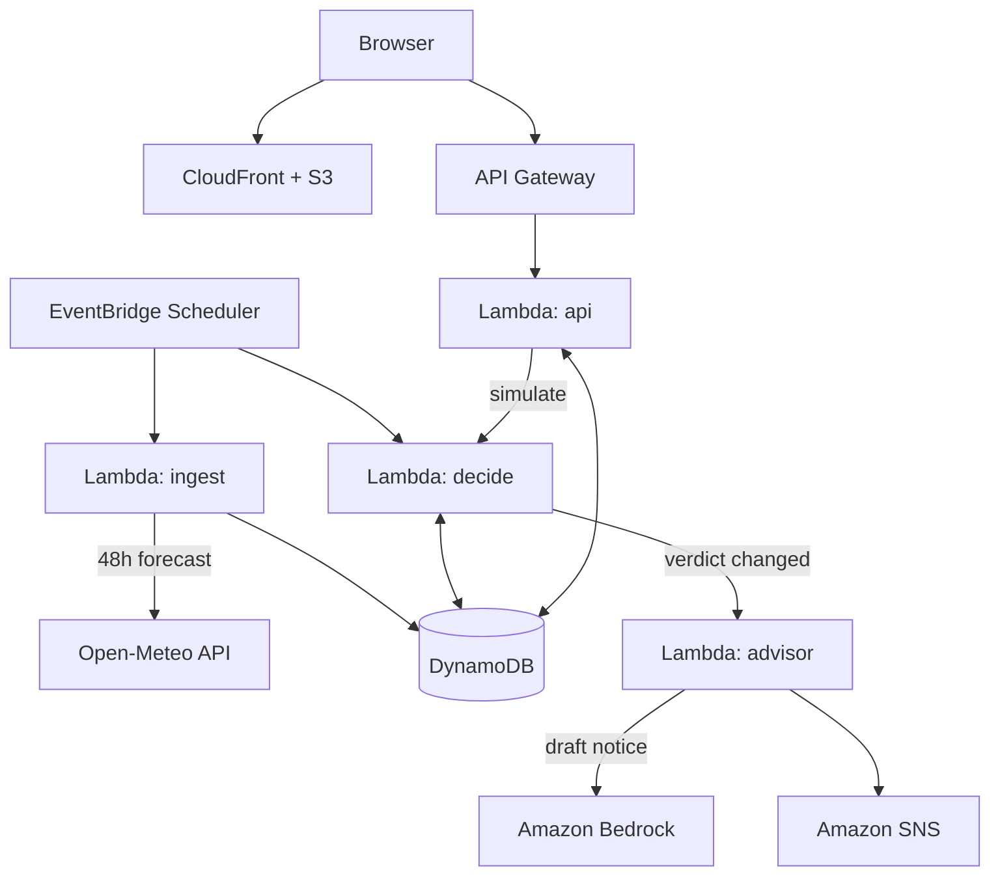

<div align="center">

# Saans

**Air-quality decision engine for schools**

Turns an hourly AQI forecast and a school timetable into clear, per-activity actions for principals.


</div>

---

## Table of Contents

1. [Overview](#overview)
2. [Features](#features)
3. [Architecture](#architecture)
4. [Tech Stack](#tech-stack)
5. [Decision Engine](#decision-engine)
6. [Project Structure](#project-structure)
7. [Getting Started](#getting-started)
---

## Overview

On high-pollution days, school principals must decide whether assembly, PT and outdoor breaks should go ahead. An AQI number alone does not answer that. Saans does.

It ingests the hourly air-quality forecast for each school, evaluates it against the school's timetable and grade-specific limits, and returns a verdict for every outdoor activity: **GO**, **MODIFY**, **MOVE** or **CANCEL**. When the verdict changes, it drafts a bilingual notice (English and Hindi) and emails it to subscribers.

Built for **Environmental Hacks** (WeMakeDevs x AWS, Bharat Builds Tour), Track 01: Air.

---

## Features

| Feature | Description |
|---|---|
| Activity-level verdicts | GO, MODIFY, MOVE or CANCEL for each outdoor slot, with the reason shown |
| Safe-window finder | Suggests the nearest safe time slot when an activity is unsafe |
| Grade-aware thresholds | Stricter limits for younger grades; configurable per school |
| Change detection | Hourly re-evaluation; notifications only when a verdict changes |
| Circular generator | English and Hindi notice drafted with Amazon Bedrock, with a template fallback |
| Exposure ledger | Weekly count of outdoor minutes moved or cancelled during unhealthy air |
| What-if simulator | Preview decisions under Normal, Stubble season or Severe scenarios without sending anything |

---

## Architecture



**Data flow**

1. EventBridge triggers the ingest function hourly; it stores the forecast in DynamoDB.
2. The decide function runs the decision engine against each school's timetable and policy.
3. If the day's verdict changed, the advisor drafts a notice and publishes it through SNS.
4. The React app, served from CloudFront, reads results through API Gateway.

---

## Tech Stack

### Backend and cloud

| Area | Technology | Purpose |
|---|---|---|
| Runtime | AWS Lambda, Python 3.12 | ingest, decide, advisor and API functions |
| Database | Amazon DynamoDB (single table, on-demand) | readings, timetables, decisions, subscribers |
| Scheduling | Amazon EventBridge Scheduler | hourly ingest and daily morning decision run |
| API | Amazon API Gateway (HTTP API) | REST interface for the web app |
| Messaging | Amazon SNS | email notifications |
| AI | Amazon Bedrock | bilingual circular drafting |
| Hosting | Amazon S3 + CloudFront (Origin Access Control) | static frontend delivery |
| Data source | Open-Meteo Air Quality API | hourly PM2.5, PM10 and US AQI forecast |

### Frontend

| Technology | Purpose |
|---|---|
| React + TypeScript | UI |
| Vite | build tooling |
| Tailwind CSS | styling and design tokens |
| TanStack Query | API data fetching and caching |
| Recharts | forecast visualisation |

### DevOps and quality

| Technology | Purpose |
|---|---|
| AWS SAM | infrastructure as code and local Lambda testing |
| GitHub Actions + OIDC | CI/CD without long-lived AWS keys |
| AWS Lambda Powertools | structured logging, tracing and custom metrics |
| Amazon CloudWatch | logs, dashboard and alarms |
| pytest | unit tests for the decision engine |

AWS open-source tools used: **AWS SAM** and **AWS Lambda Powertools**. The application is also deployed on AWS.

---

## Decision Engine

The engine lives in `backend/src/core/` as pure Python with no AWS imports, so real decisions and simulations share the same code and are fully unit-testable.

**Default policy (US AQI, configurable per school)**

| AQI | Tier | Outdoor activity |
|---|---|---|
| 0 to 100 | Green | GO |
| 101 to 150 | Amber | MODIFY for sensitive grades |
| 151 to 200 | Orange | MOVE to a safe window, otherwise CANCEL |
| 201 and above | Red / Maroon | CANCEL, use an indoor alternative |

- A slot's AQI is the maximum hourly value within its time range.
- Grades up to 5 are evaluated one tier stricter.
- The safe-window finder looks for the nearest span in school hours that is long enough for the activity and at or below Amber.
- A hash of the verdict list is stored per day; a notification is sent only when the hash changes.

> Thresholds are an example school policy, not official medical or government guidance.

---

## Project Structure

```
saans/
├── template.yaml            # all AWS infrastructure (SAM)
├── samconfig.toml
├── backend/
│   ├── src/
│   │   ├── ingest/          # forecast ingestion
│   │   ├── decide/          # runs the decision engine
│   │   ├── advisor/         # notice drafting and SNS publishing
│   │   ├── api/             # HTTP API handlers
│   │   └── core/            # decision logic (no AWS imports)
│   ├── tests/
│   ├── scripts/seed.py      # demo schools and timetables
│   └── requirements.txt
├── frontend/                # React application
├── .github/workflows/       # CI/CD pipeline
└── docs/                    # architecture diagram, demo script
```

---

## Getting Started

### Prerequisites

- AWS account with the AWS CLI configured
- AWS SAM CLI
- Python 3.12
- Node.js 20 or later

### Run the tests

```bash
cd backend
pip install -r requirements.txt
pytest
```

### Deploy the backend

The deployment requires an operator-provided HTTPS CloudFront origin and a
schools JSON file containing the exact school coordinates and time zones. Do
not commit either file if it contains private configuration or credentials.

```bash
sam validate --lint --template-file template.yaml --region ap-south-1
sam build --template-file template.yaml --region ap-south-1
sam deploy --guided --template-file template.yaml --region ap-south-1 \
  --parameter-overrides FrontendOrigin=https://d123example.cloudfront.net
# Replace the example origin with the actual deployed CloudFront HTTPS origin.
# On later deployments, reuse the generated samconfig.toml and keep the same
# FrontendOrigin parameter value.
```

After deployment, initialize school metadata and timetables. The JSON input
must provide `id`, `name`, `city`, `lat`, `lon`, and `tz` for each school; the
script uses the plan's default timetable unless `slots` are supplied.

```bash
python backend/scripts/seed.py \
  --table-name saans-main \
  --schools-file path/to/schools.json
```

Once seed records exist, invoke ingestion so the API has `AQ#...` forecast
readings. The handler resolves seeded schools from DynamoDB when the event has
no explicit school list.

```bash
aws lambda invoke \
  --region ap-south-1 \
  --function-name "$(aws cloudformation describe-stacks \
    --region ap-south-1 \
    --stack-name <stack-name> \
    --query "Stacks[0].Outputs[?OutputKey=='IngestFunctionArn'].OutputValue" \
    --output text)" \
  --payload '{}' \
  /tmp/saans-ingest-response.json
```

Use the deployed `ApiUrl` stack output as the frontend API base:

```bash
export VITE_API_BASE="<ApiUrl output>"
cd frontend
npm install
npm run dev
```

### Run the frontend locally

```bash
cd frontend
npm install
echo "VITE_API_BASE=<ApiUrl output>" > .env.local
npm run dev
```

---

## Deployment and CI/CD

On every push to `main`, GitHub Actions runs:

1. Lint and `pytest`
2. `sam validate` and `sam build`
3. `sam deploy` using an IAM role assumed through GitHub OIDC
4. Frontend build, `aws s3 sync`, then CloudFront invalidation

All infrastructure is defined in `template.yaml`; no manual console configuration is required beyond the initial account setup and SNS email confirmation.

---

## API Reference

| Method | Endpoint | Description |
|---|---|---|
| GET | `/schools` | List schools |
| GET | `/schools/{id}/brief` | Today's verdict, slot decisions and safe windows |
| GET | `/schools/{id}/forecast` | 48-hour AQI forecast |
| POST | `/schools/{id}/simulate` | What-if scenario; nothing is stored or sent |
| POST | `/schools/{id}/circular` | Generate notice text (English and Hindi) |
| POST | `/schools/{id}/notify` | Send the notice to subscribers |
| POST | `/schools/{id}/subscribers` | Add an email subscriber |

Errors use a consistent shape: `{ "error": { "code": "...", "message": "..." } }`.

---

## License

Released under the MIT License. See [LICENSE](LICENSE).
 
 Built by Yash Patil, all rights reserved 2026

</div>
